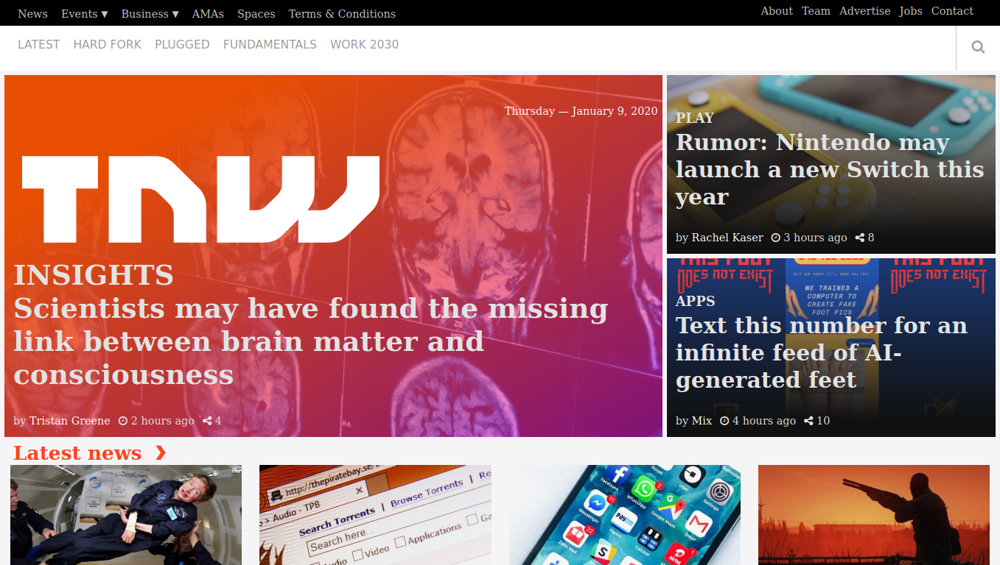

# TheNextWeb-Clone

> A clone of [TheNextWeb.com](https://thenextweb.com/)

Project: Building with Responsive Design

## Built With

- HTML5,
- CSS3,
- Grids,
- Flex

## Live Demo

[Live Demo Link](https://raw.githack.com/mariancristu/TheNextWeb/feature-main-section/index.html)

## Getting Started

**Use browser of choise**

## Authors

👤 **Martin Njoroge**

- Github: [@kwizl](https://github.com/kwizl)
- Twitter: [@NjoroKaris](https://twitter.com/NjoroKaris)
- Linkedin: [martin njoroge](https://www.linkedin.com/in/martin-njoroge-098774110/)

👤 **Cristu Marian**

- Github: [@mariancristu](https://github.com/mariancristu)
- Twitter: [@marian_cristu](https://twitter.com/marian_cristu)
- Linkedin: [marian-cristu](https://www.linkedin.com/in/marian-cristu-b687b3197)

## 🤝 Contributing

Contributions, issues and feature requests are welcome!

Feel free to check the [issues page](https://github.com/mariancristu/TheNextWeb/issues).

## Show your support

Give a ⭐️ if you like this project!
